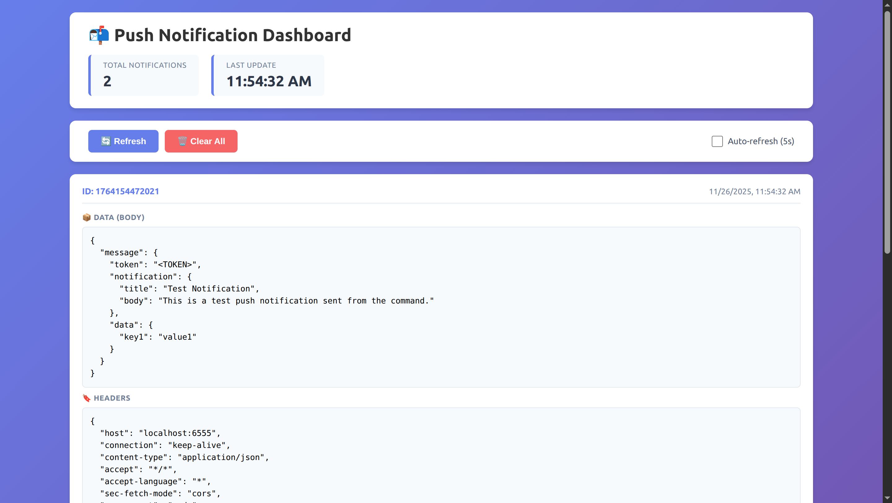

# Push Notification Catcher

Inspired by https://github.com/dockage/mailcatcher, this tool allows you to capture push notifications sent by your backend during local development.

## How it works

You need to stub your push notification service to use this URL: http://localhost:6555/push.

I mainly created this project to help me during the development of my Adonis 6 project. I created an Adonis 6 package to support push notifications. The configuration allows me to enable a stub and replace the API URL; [more info here](https://github.com/juliendu11/adonis-js-push-notification).

## Features

- Dashboard to view captured push notifications
- View detailed information about each notification
- Clear all captured notifications
- API REST endpoints
  - DELETE http://localhost:6555/messages - Clear all captured notifications
  - GET http://localhost:6555/messages - List all captured notifications

## How to use

### Docker solution

1. Run `docker run -p 6555:6555 juliendu11/push-notification-catcher:latest` to start the server
2. Open your browser and navigate to `http://localhost:6555` to access the dashboard

### Docker Compose solution

1. Clone this repository
2. Run `docker-compose up`

### Standalone solution

1. Clone this repository
2. Run `npm install` to install dependencies
3. Run `node ./index.js` to start the server
4. Open your browser and navigate to `http://localhost:6555` to access the dashboard